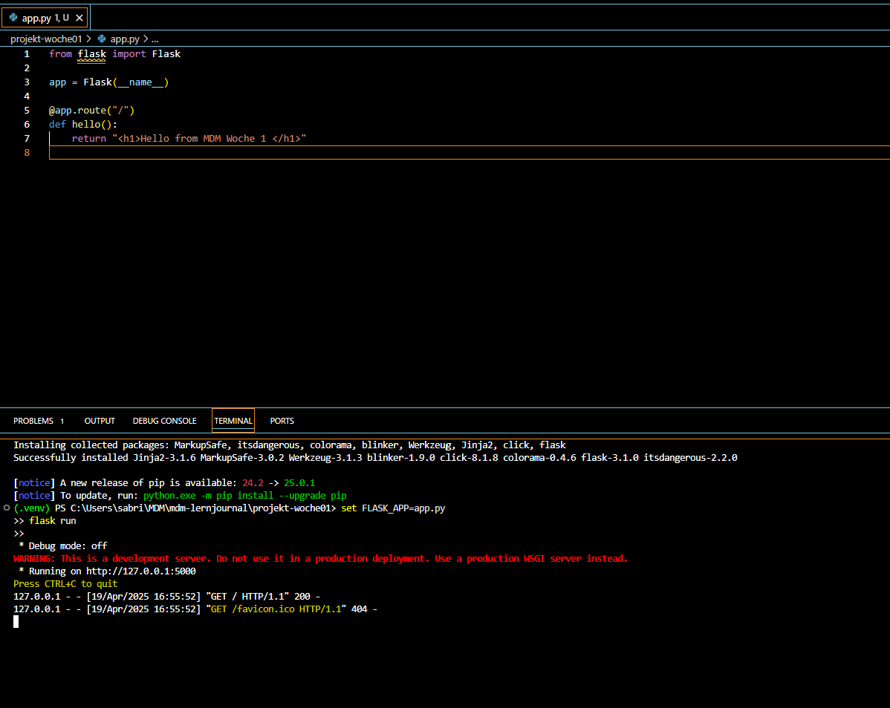

# Lernjournal 1 Python

## Repository und Library

|                           |                                                                                  |
|---------------------------|----------------------------------------------------------------------------------|
| **Repository (URL)**      | https://github.com/<dein-benutzername>/MDM-Lernjournal/tree/main/lernjournal1-python |
| **Kurze Beschreibung**    | Eine einfache Flask-App, die auf `localhost:5000` eine HTML-Ausgabe liefert.     |
| **Verwendete Library**    | Flask                                                                             |
| **Library-Link (PyPI)**   | https://pypi.org/project/Flask/                                                  |

---

## App, Funktionalität

Die App zeigt beim Aufruf der URL `http://localhost:5000` eine einfache HTML-Ausgabe im `<h1>`-Format:

```python
from flask import Flask

app = Flask(__name__)

@app.route("/")
def hello():
    return "<h1>Hello from MDM Woche 1 </h1>"
```

> 🖼️ **Screenshot Browser:**
>
> 

---

## Dependency Management

Die Datei `requirements.txt` enthält:

```text
blinker==1.9.0
click==8.1.8
colorama==0.4.6
Flask==3.1.0
itsdangerous==2.2.0
Jinja2==3.1.6
MarkupSafe==3.0.2
Werkzeug==3.1.3
```

Damit kann die App in einem sauberen virtuellen Environment gestartet werden:

```bash
python -m venv venv
venv\Scripts\activate
pip install -r requirements.txt
```

> 🖼️ **Terminal bei `flask run`**
>
> 

---

## Deployment

Die Anwendung wurde lokal mit folgendem Befehl gestartet:

```bash
set FLASK_APP=app.py
flask run
```

Der Webserver läuft auf `http://127.0.0.1:5000`. 

Die Ausgabe erscheint direkt im Browser:

> 🖼️ **Browseransicht lokal:**
>
> 

---
