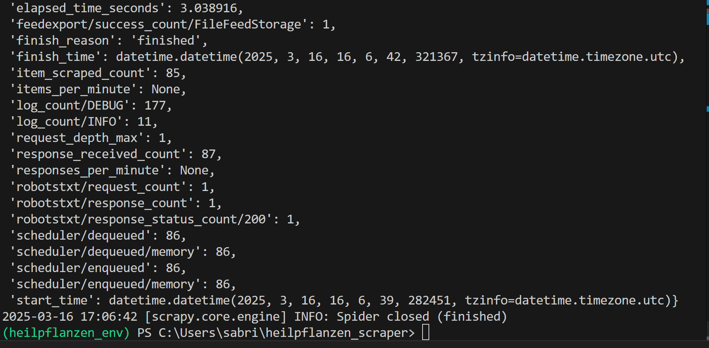
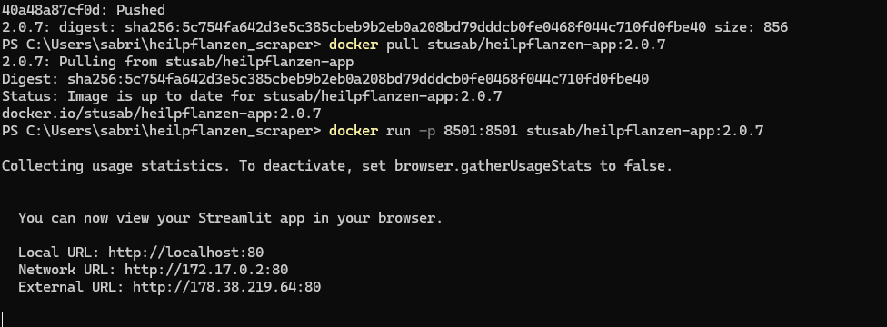
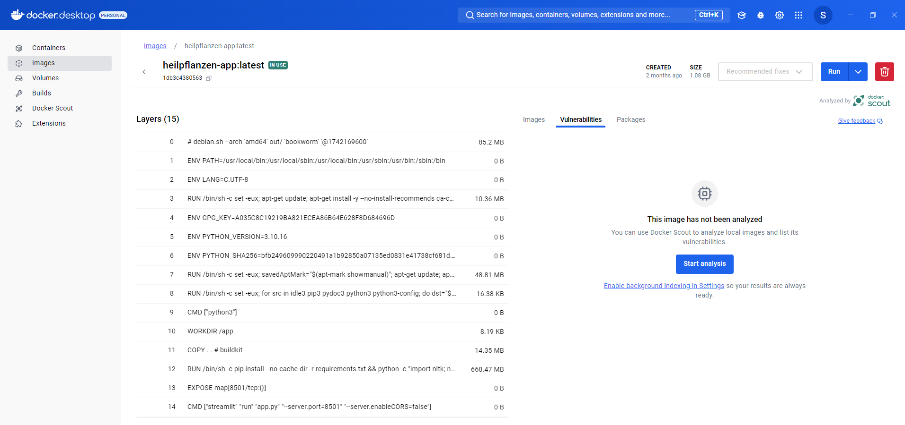
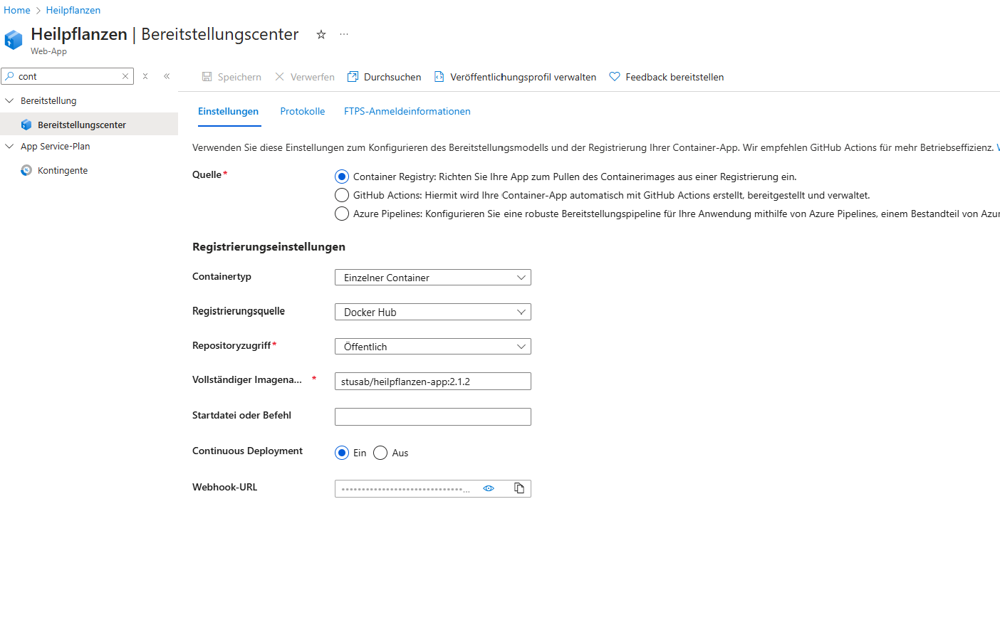
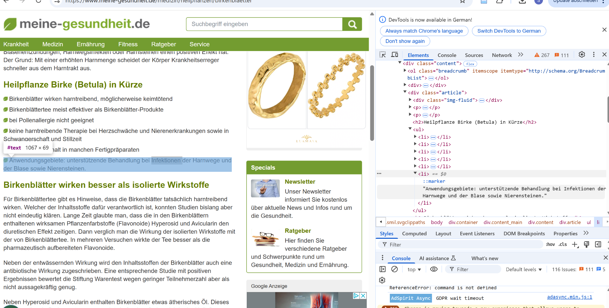
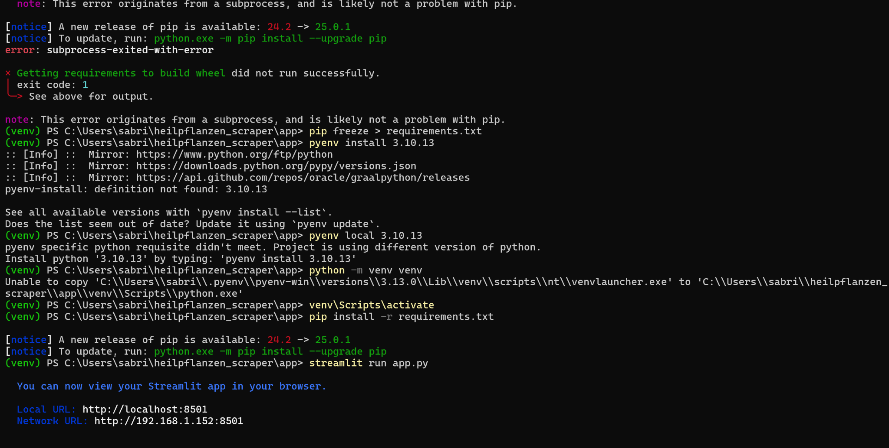

# Lernjournal 1 Python

## Repository und Library

| | Bitte ausfüllen |
| -------- | ------- |
| Repository (URL)  |
| Kurze Beschreibung der App-Funktion |Ziel des Projekts war es, eine intelligente Webanwendung zu entwickeln, die Heilpflanzen auf Basis von Benutzersymptomen vorschlägt. Dies geschieht durch semantisches Matching von eingegebenem Freitext mit einem vordefinierten Heilpflanzen-Symptom-Datensatz. |
| Verwendete Library aus PyPi (Name) | Verwendete Library aus PyPi (URL) |
|------------------------------------|-----------------------------------|
| streamlit                         | https://pypi.org/project/streamlit/ |
| scikit-learn                      | https://pypi.org/project/scikit-learn/ |
| nltk                              | https://pypi.org/project/nltk/ |
| pandas                            | https://pypi.org/project/pandas/ |
| sentence-transformers             | https://pypi.org/project/sentence-transformers/ |
| transformers                      | https://pypi.org/project/transformers/ |
| torch                             | https://pypi.org/project/torch/ |
| beautifulsoup4                    | https://pypi.org/project/beautifulsoup4/ |


# Lernjournal 1 – Heilpflanzen App mit semantischer Suche & Model Deployment

## App, Funktionalität

Die Nutzeroberfläche erlaubt es, über eine **Streamlit-Seite Symptome einzugeben**.  
Mittels **SentenceTransformer** (`distiluse-base-multilingual-cased-v1`) werden die Eingaben semantisch mit einem CSV-Symptom-Datensatz verglichen und die Top-N ähnlichsten Heilpflanzen-Einträge zurückgegeben.

Ein **Scrapy-Crawler** lädt automatisiert **Heilpflanzen-Webseiten** und extrahiert `Name` + `Anwendungsgebiete` über XPath oder CSS.  
Zur Ermittlung von Selektoren wurde auch ein BeautifulSoup-Test durchgeführt.

> 🖼️ **Scrapy Spider erfolgreich abgeschlossen:**  
> 

---

## Dependency Management

Die Datei `requirements.txt` enthält alle benötigten Python-Bibliotheken inkl. exakter Versionen (z. B. `sentence-transformers==2.2.2`, `streamlit==1.10`). 

Das Dockerfile sorgt mit folgendem Befehl dafür, dass alle Abhängigkeiten reproduzierbar installiert werden:

```bash
RUN pip install --no-cache-dir -r requirements.txt
```

---

## Containerisierung & Lokales Deployment

Die Anwendung wurde containerisiert über ein Dockerfile und kann lokal via:

```bash
streamlit run app.py --server.port=8501 --server.address=0.0.0.0
```

oder via Docker ausgeführt werden.

> 🖼️ **Docker-Container mit Streamlit lokal ausgeführt:**  
> 

> 🖼️ **Docker-Image aufgebaut und einsatzbereit:**  
> 

---

## Azure Deployment

Das erstellte Docker-Image `stusab/heilpflanzen-app:2.1.2` wurde auf **Docker Hub** veröffentlicht und in einer **Azure Web App** eingebunden.

> 🖼️ **Azure App Service mit Container Registry Deployment:**  
> 

⚠️ **Hinweis:** Das Deployment auf Azure konnte leider nicht erfolgreich abgeschlossen werden, da es zu Authentifizierungs- oder Berechtigungsproblemen kam (z. B. Studenten-Account-Limitierungen). Die App läuft jedoch **lokal vollständig stabil und reproduzierbar**.

---

## Webanalyse & Scraping-Vorbereitung

Zur Extraktion der Informationen wurden XPath- oder CSS-Selektoren mit Hilfe der DevTools analysiert. Hierbei wurde z. B. gezielt auf Listeneinträge unter dem "Anwendungsgebiete"-Header geachtet.

> 🖼️ **Analyse der DOM-Struktur mit Chrome DevTools:**  
> 

---

## Lokale Ausführung (venv)

Die Anwendung kann alternativ auch ohne Docker lokal mit virtueller Umgebung ausgeführt werden:

```bash
python -m venv venv
venv\Scripts\activate
pip install -r requirements.txt
streamlit run app.py
```

> 🖼️ **Streamlit lokal mit venv gestartet:**  
> 

---

## Fazit

Das Projekt zeigt den kompletten Ablauf von **Scraping**, **Datenverarbeitung**, **Modellbereitstellung**, **Containerisierung** bis hin zum (versuchten) **Deployment auf Azure**. 

Die Anwendung funktioniert **lokal einwandfrei**, das Deployment in der Cloud scheiterte jedoch aufgrund externer Restriktionen.

