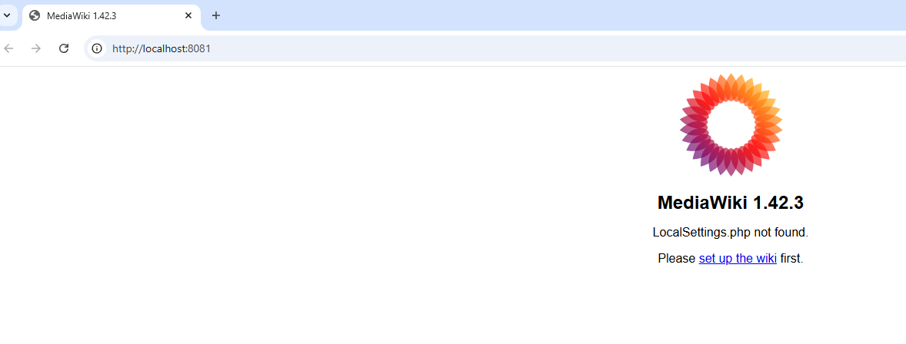
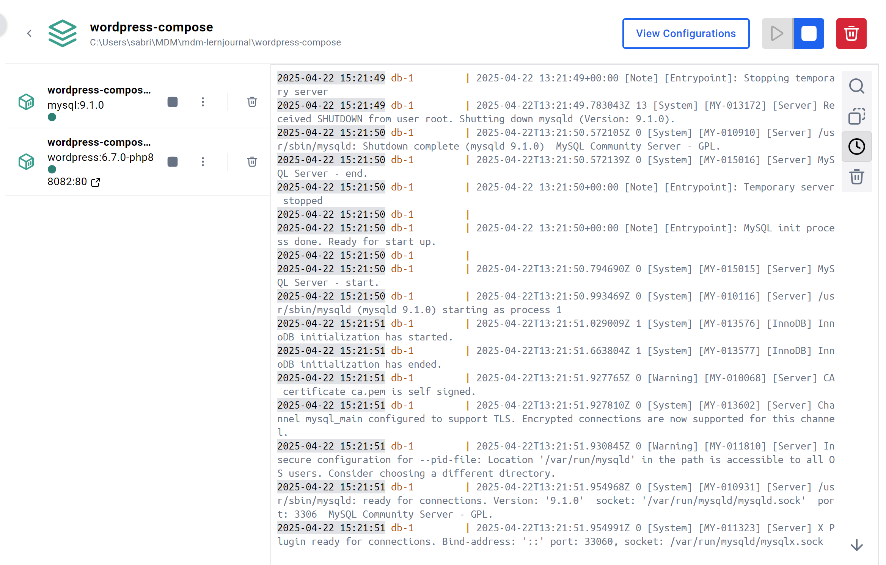
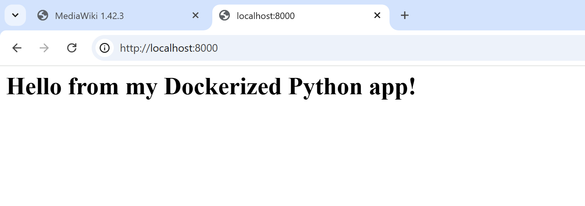
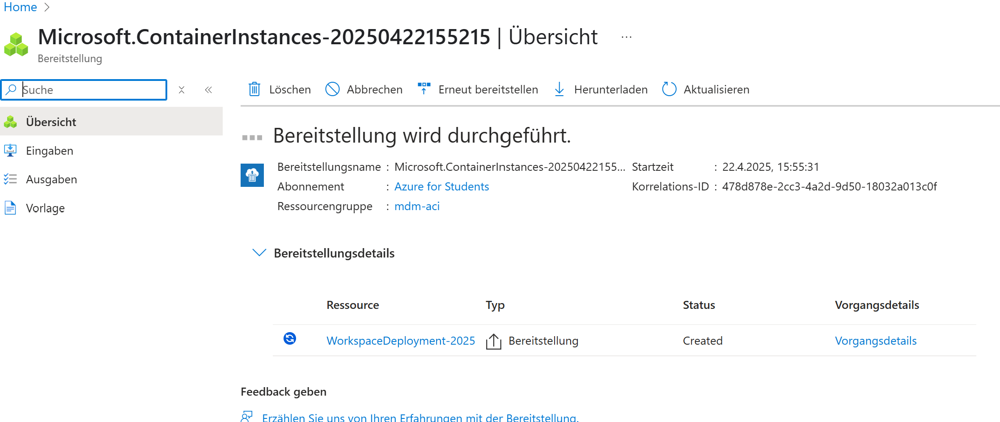
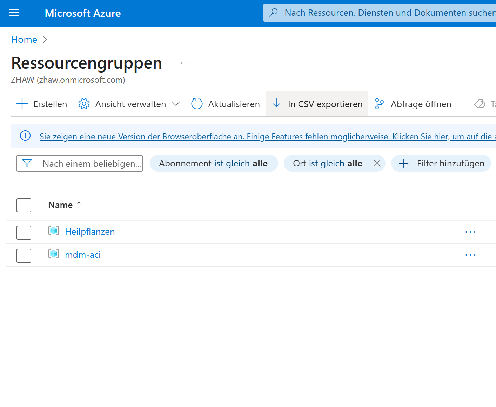

# Lernjournal 2 Container

## Docker Web-Applikation

### Verwendete Docker Images

| Image       | Beschreibung / Quelle |
|-------------|------------------------|
| MediaWiki   | https://hub.docker.com/_/mediawiki |
| MariaDB     | https://hub.docker.com/_/mariadb |
| Docker Compose | https://github.com/Stusab/MDM_Lernjournal/tree/main/lernjournal2-container |

### Dokumentation manuelles Deployment

- MediaWiki Container mit `docker run` gestartet:
  ```bash
  docker run --name wiki-container -p 8081:80 -v mediawiki:/var/www/html -d mediawiki:1.42.3
  ```
- Aufruf im Browser unter `http://localhost:8081`
- `docker ps` zeigt laufenden Container


- Weboberfläche ist erreichbar → LocalSettings.php wird angezeigt



### Dokumentation Docker-Compose Deployment

- `docker-compose.yml` mit MediaWiki + MariaDB definiert
- Start mit:
  ```bash
  docker-compose up -d
  ```
- Erreichbar unter `http://localhost:8080`


- Screenshot der `docker ps`-Ausgabe im Projekt enthalten



- Vorteil: vereinfachte Verwaltung durch automatische Netzwerk- & Volume-Zuordnung

---

## Deployment ML-App

### Variante und Repository

| Beispiel                    | Entscheidung |
|----------------------------|--------------|
| onnx-sentiment-analysis    | Nein         |
| onnx-image-classification  | Geplant      |
| Repo URL Fork              | –            |
| Docker Hub URL             | –            |

### Dokumentation lokales Deployment

- Eine einfache Python-App wurde erstellt und lokal mit Docker gebaut und getestet.



### Dokumentation Deployment Azure Web App

- Ich habe versucht, eine Azure Web App zu erstellen. Leider kam es beim Deployment zu einem Zugriffsfehler (403), vermutlich aufgrund fehlender Rechte in meiner Azure-Umgebung.


### Dokumentation Deployment ACA

- Eine ACI-Instanz wurde vorbereitet und getestet. Die Ressourcengruppe wurde im Azure-Portal angelegt.




### Dokumentation Deployment ACI

- Noch nicht durchgeführt

