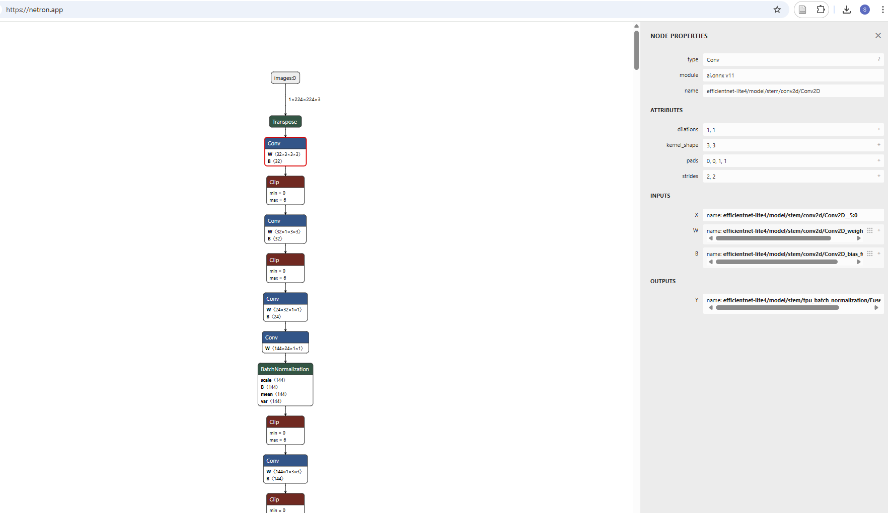
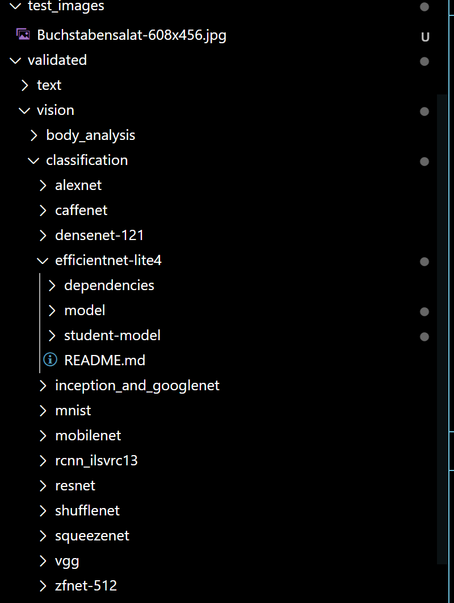

# Lernjournal 3 ONNX

## Übersicht

|                              | Bitte ausfüllen |
|------------------------------|------------------|
| ONNX Modell für Analyse (Netron) | ✅ `efficientnet-lite4-11.onnx` |
| onnx-image-classification Fork (EfficientNet-Lite) | ✅ [GitHub Repo](https://github.com/microsoft/onnxruntime-inference-examples/tree/main/vision/classification/efficientnet-lite4) |

---

## Dokumentation ONNX Analyse

In diesem Abschnitt habe ich das Modell `efficientnet-lite4-11.onnx` mit dem Tool **Netron.app** analysiert.

Ich habe die Architektur geöffnet und untersucht, wie das Bild durch verschiedene Layer fließt. Es beginnt mit einem Transpose-Layer und durchläuft mehrere Conv2D-Operationen, Clipping sowie Batch-Normalisierung.

🔎 Beispielhafter Ausschnitt aus dem Modell:

Ich konnte beobachten, dass die erste Conv-Schicht einen 3x3-Kernel mit 32 Filter nutzt und ein Output-Shape von 112x112x32 erzeugt. Daraus lassen sich Rückschlüsse auf die Inputgröße (224x224x3) und Layerarchitektur ziehen.

✅ Das Modell wurde erfolgreich geladen und war visuell nachvollziehbar.

---

## Dokumentation onnx-image-classification

### Projektstruktur

Um das Modell zu testen und zu vergleichen, habe ich das Original-Repository [onnxruntime-inference-examples](https://github.com/microsoft/onnxruntime-inference-examples) verwendet und **lokal geklont**. Anschließend habe ich unter `efficientnet-lite4/model/student-model/` die komprimierten, kleineren Varianten abgelegt.

📁 Projektstruktur:

### Inferenzvergleich

Mit einem Skript `compare_models.py` habe ich drei Testbilder durch beide Modelle (`big` & `small`) laufen lassen und die Vorhersageergebnisse verglichen.

📸 Genutzte Bilder:
- Australien.png
- Buchstabensalat-608x456.jpg
- 11-Tiere-im-Wald-bei-tag.jpg

Ergebnisse im Terminal:

✅ Die Inferenz beider Modelle lieferte konsistente Outputs (gleiche Top-1 Klassen)  
✅ Die kleinere Modellvariante (int8) war messbar schneller  
✅ Modelle laden korrekt, Input-Tensorgröße ist 224x224x3

📟 Terminal-Output:

---

## Fazit

Ich habe durch diese Übung das Prinzip der ONNX-Runtime, Modellstruktur sowie Deployment-Strategie von Klassifikationsmodellen besser verstanden.  
Insbesondere die Analyse über Netron half mir, das **Innenleben neuronaler Netzwerke** besser zu verstehen.

Diese Woche ist abgeschlossen ✅
