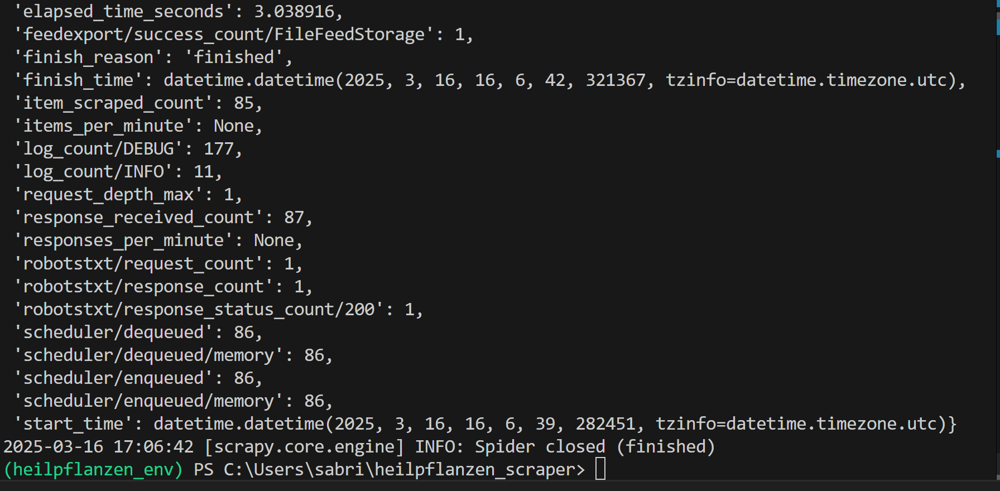
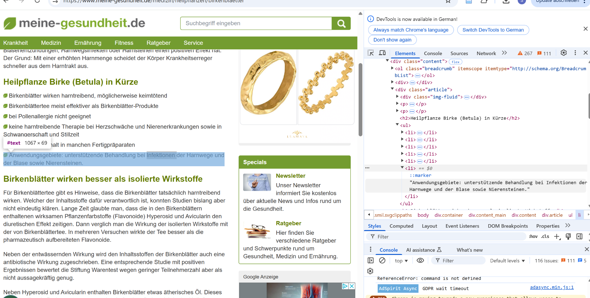
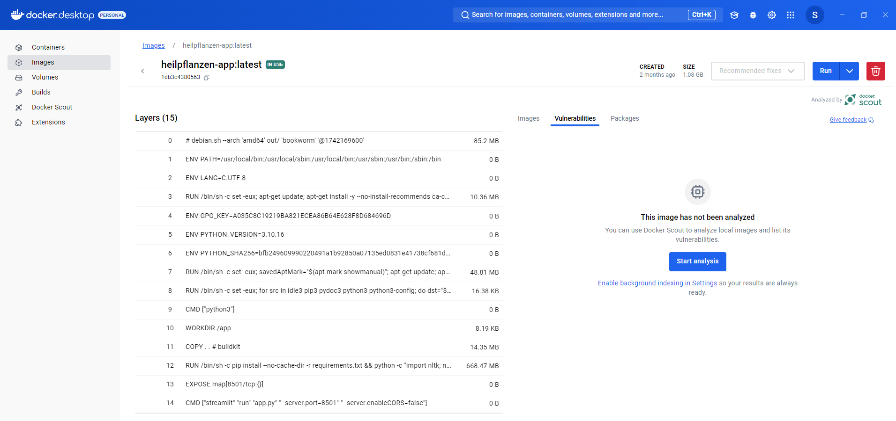
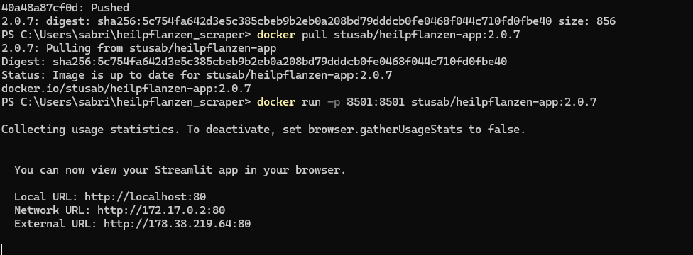
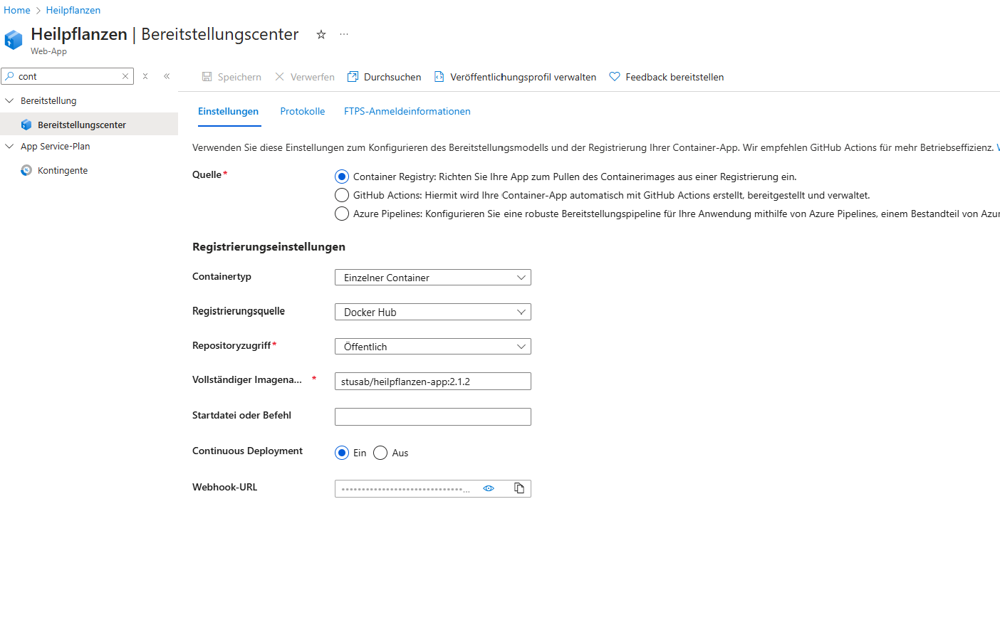

# Projekt 1 Python

## Übersicht


|                        | Bitte ausfüllen                                       |
|------------------------|----------------------------------------------------------|
| **Variante**           | Eigenes Projekt                                          |
| **Datenherkunft (Format)** | HTML (Scraping mit XPath/CSS), JSON (Zwischenspeicherung) |
| **Datenherkunft (URL)**| https://www.meine-gesundheit.de                          |
| **ML-Algorithmus**     | SentenceTransformer (distiluse-base-multilingual-cased-v1) |
| **Repo URL**           | https://github.com/<dein-benutzername>/heilpflanzen-app |


## Dokumentation

### ✅ Data Scraping
Ein Scrapy-Spider wurde erstellt, der Heilpflanzen-Daten von der Website `meine-gesundheit.de` extrahiert. Die Struktur der Seite wurde über die Developer Tools inspiziert, XPath-Selektoren wurden gezielt auf Listeninhalte nach "Anwendungsgebiete" angewendet. 

>   
> Scrapy Spider hat erfolgreich 85 Items extrahiert und gespeichert.

>   
> DOM-Analyse zur Identifikation relevanter Inhalte.

---

### ✅ Training
Die App verwendet keine klassische ML-Modell-Trainingsschleife, sondern einen **vorgelernten SentenceTransformer** (distiluse-base-multilingual-cased-v1). Eingaben werden mit vorhandenen Texten vektorisiert verglichen und semantisch gematcht.

- Vergleich erfolgt auf Vektor-Ebene mittels Cosine Similarity
- Trainingsdaten sind nicht notwendig, da Zero-Shot Retrieval

---

### ✅ ModelOps Automation
Die Anwendung wird mit einem Dockerfile paketiert. Alle Abhängigkeiten sind in der `requirements.txt` definiert.

```dockerfile
FROM python:3.10
COPY . .
RUN pip install --no-cache-dir -r requirements.txt
EXPOSE 8501
CMD ["streamlit", "run", "app.py", "--server.port=8501", "--server.enableCORS=false"]
```

>   
> Docker Image mit korrekt definierten Umgebungen und Ports.

---

### 🟡 Deployment
Die Anwendung läuft lokal stabil mit Docker (`localhost:80` oder `8501`). Ein Azure-Deployment wurde vorbereitet, konnte jedoch aufgrund Account-Einschränkungen nicht abgeschlossen werden.

>   
> Lokaler Docker-Container gestartet und erreichbar

>   
> Azure Deployment vorbereitet – Fehler beim Zugriffsrecht

---

✅ **Projektumsetzung dokumentiert Scraping, semantische Suche, Containerisierung und lokale Ausführung.**


