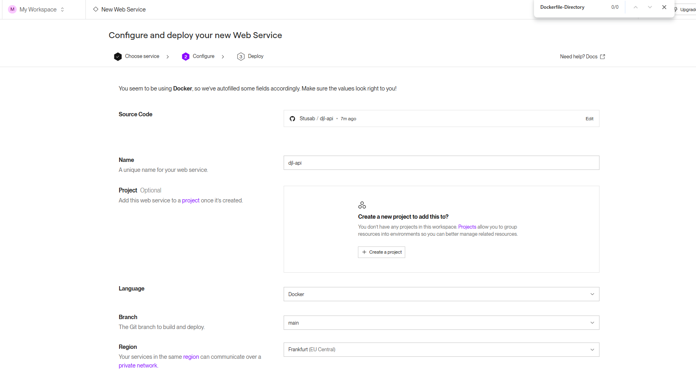

# Projekt 2 Java

## Übersicht

|                             | Bitte ausfüllen                                                                 |
|-----------------------------|----------------------------------------------------------------------------------|
| **Variante**                | Selbsttrainiertes Modell                                                        |
| **Datensatz (wenn selbstgewählt)** | Format: JPG, Beschreibung: Kaggle-Datensatz mit Bildern giftiger und ungiftiger Pflanzen |
| **Datensatz (wenn selbstgewählt)** | https://www.kaggle.com/datasets/hanselliott/toxic-plant-classification               |
| **Modell (wenn selbstgewählt)**    | Lokal trainiertes CNN-Modell, gespeichert unter `/djl-model/models/plantdetector/`        |
| **ML-Algorithmus**          | Convolutional Neural Network (CNN) mit SoftmaxCrossEntropyLoss                  |
| **Repo URL**                | [https://github.com/Stusab/djl-api](https://github.com/Stusab/djl-api)         |

---

## Dokumentation

### ✅ Daten

- Verwendet wurde ein öffentlich verfügbarer Datensatz von **Kaggle**:
  - [Toxic Plant Classification Dataset](https://www.kaggle.com/datasets/hanselliott/toxic-plant-classification)
- Der Datensatz enthält Bilder von giftigen und ungiftigen Pflanzen.
- Aufteilung erfolgte lokal in `train/{toxic,nontoxic}` und `valid/{toxic,nontoxic}`.
- Bildformat: JPG

📸 **Trainingsdatenstruktur sichtbar beim Training:**  

---

### ✅ Training

- Modelltraining erfolgte in einem separaten Maven-Modul namens `djl-model`.
- Trainings- und Validierungsdaten wurden aus dem Kaggle-Set bezogen.
- Loss-Funktion: **SoftmaxCrossEntropyLoss**
- Beste erreichte Accuracy: **~75%**

📸 **Finaler Trainingslauf:**  

---

### ✅ Inference / Serving

- Spring Boot REST API implementiert in `djl-api`.
- POST-Endpunkt `/api/analyze` akzeptiert Bilddateien und gibt die Klassifikation als JSON zurück.
- Modell wird beim Start automatisch aus dem lokalen Pfad geladen.
- Zusätzlich wurde eine einfache Web-UI erstellt (HTML/CSS), die Bild-Uploads ermöglicht und die Klassifikation visuell anzeigt.

📸 **Konsolenansicht beim Starten der API:**  

📸 **Erste Test-UI für JSON-Ausgabe:**  

📸 **Finale UI mit Ergebnisanzeige:**  

---

### ✅ Deployment

- Das Projekt wurde mit einem Dockerfile containerisiert.
- Deployment erfolgte auf **Render.com** über GitHub-Integration und Auswahl des Docker-Runtimes.
- Region: EU (Frankfurt)
- Ich habe mich bewusst gegen das Deployment mit Azure entschieden, da es im Projekt 1 auch nach langem ausprobieren nicht funktioniert hat.
- Desshalb habe ich Render und Streamlit Cloud deplyed

📸 **Deploy-Konfiguration bei Render:**  

---

